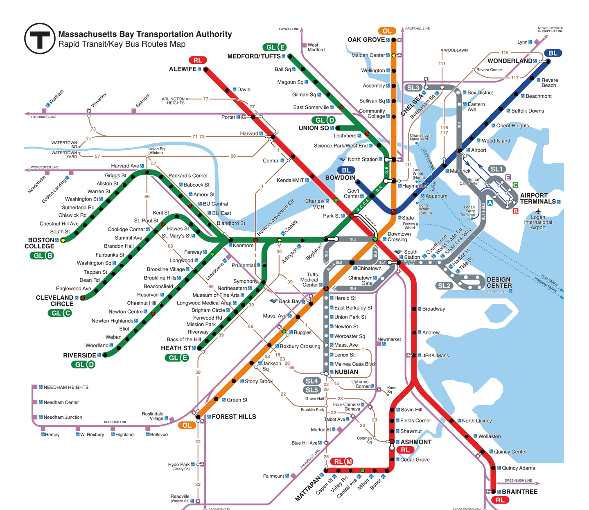

# MBTA LED Project

I needed to cover up some of my wallspace, so this is a quick project to query the MBTA API for the current whereabouts
of all T trains, and light up some LEDs

## Prerequisites (Simulator)
- Install correct version of python (recommend pyenv - https://github.com/pyenv/pyenv)
- Install Python Poetry (https://python-poetry.org/docs/)
- ```pyenv install 3.11.2```
- ```pyenv global 3.11.2```
- (From root of project)```poetry install```

## Prerequisites (Actual Hardware)
- TODO

## Access to MBTA API

The MBTA allows you access to their api without a key (10,000 requests per day).

This isn't enough to run the simulator/hardware 24/7.

Considering keys are free, there's no downsides to requesting one, which bumps you up to 1000 requests
per minute:

https://api-v3.mbta.com/

Once you have a key, add the following entry to your
$HOME/.netrc file:

```
machine api-v3.mbta.com
password <api key goes here>
```

## Simulator



To run simulator:

```poetry run python main.py```

## Tests

To run tests:

``` poetry run pytest tests/```

